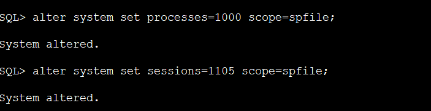

# ORA-12516 "TNS监听程序找不到符合协议堆栈要求的可用处理程序" 解决方案

http://swiftlet.net/archives/category/java-basic/page/2

> SQL> alter system set processes=1000 scope=spfile;
>
> SQL> alter system set sessions=1105 scope=spfile;