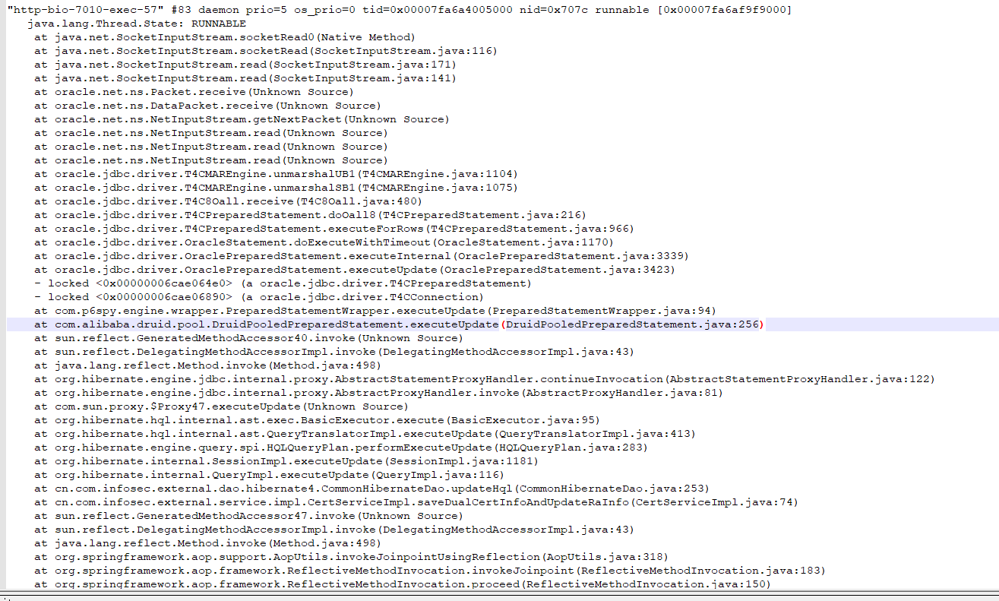
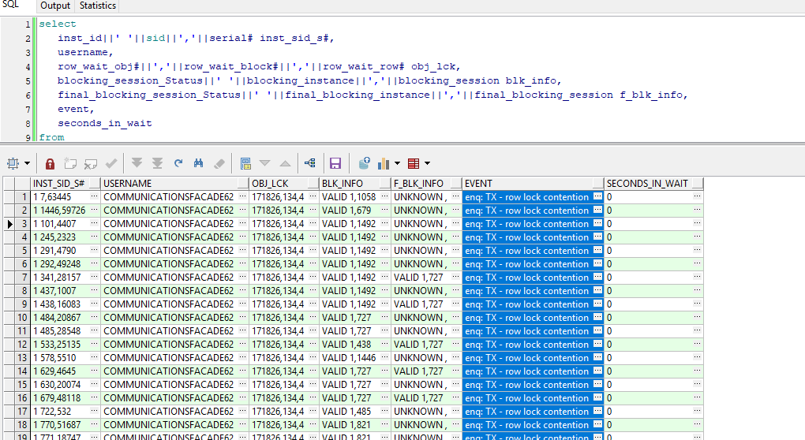
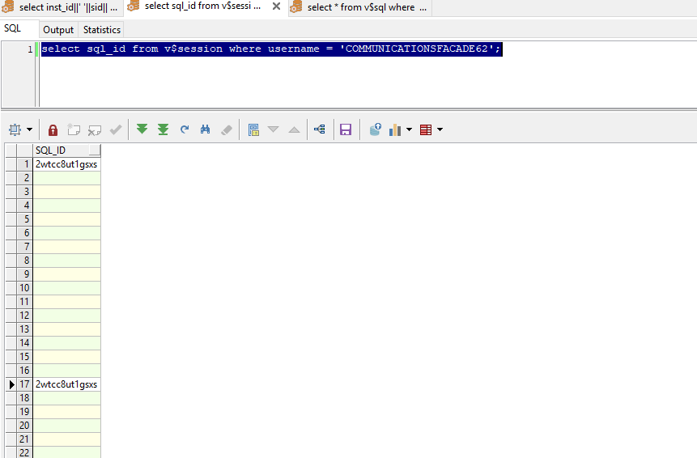
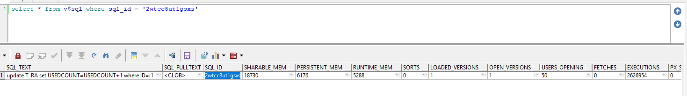
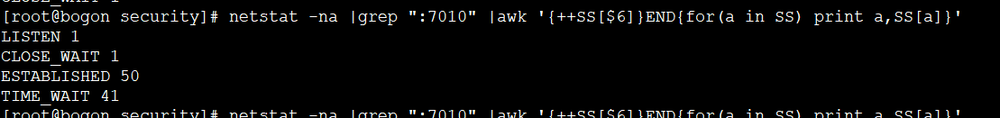
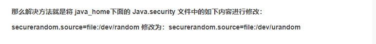

https://cloud.tencent.com/developer/ask/68190

> select 
>    inst_id||' '||sid||','||serial# inst_sid_s#, 
>    username,
>    row_wait_obj#||','||row_wait_block#||','||row_wait_row# obj_lck,
>    blocking_session_Status||' '||blocking_instance||','||blocking_session blk_info,
>    final_blocking_session_Status||' '||final_blocking_instance||','||final_blocking_session f_blk_info,
>    event, 
>    seconds_in_wait 
> from 
>    gv$session 
> where 
>    lockwait is not null
> order by 
>    inst_id;

> select sql_id from v$session where username = 'COMMUNICATIONSFACADE62';

> select * from v$sql where sql_id = '2wtcc8ut1gsxs'

https://blog.51cto.com/zhangshaoxiong/1206277

> [root@bogon security]# netstat -na |grep ":7010" |awk '{++SS[$6]}END{for(a in SS) print a,SS[a]}'

https://yq.aliyun.com/articles/130142

